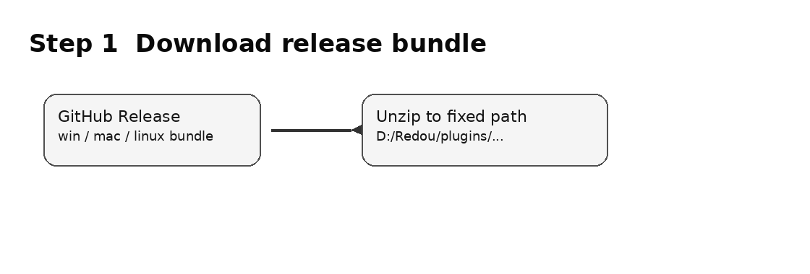
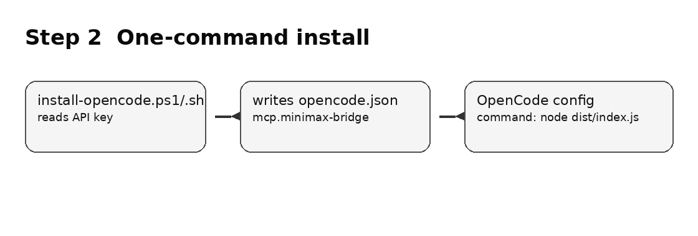
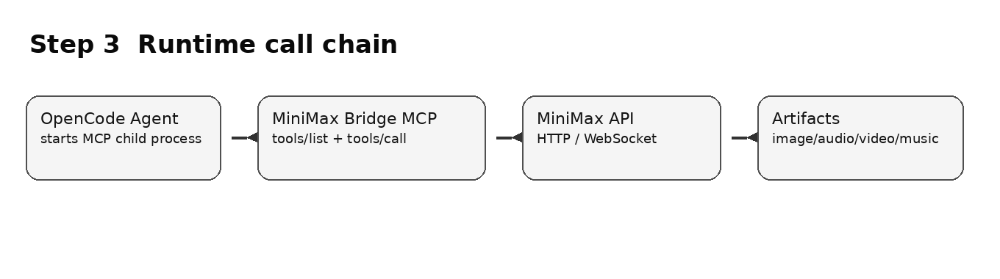

# OpenCode 安装 MiniMax Bridge MCP

这个包是一个本地 stdio MCP server。安装后，OpenCode 会在启动会话时自动运行 `node dist/index.js`，然后通过 MCP `tools/list` 和 `tools/call` 使用 MiniMax 工具。你不需要手动长期运行这个服务。

## 1. 下载发布包

从 GitHub Releases 下载与你系统对应的包：

- Windows: `minimax-bridge-mcp-*-win-x64.zip`
- macOS: `minimax-bridge-mcp-*-macos-universal.tar.gz`
- Linux: `minimax-bridge-mcp-*-linux-x64.tar.gz`

解压到固定目录，例如：

```text
D:\Redou\plugins\minimax-bridge-mcp
```



## 2. 一键写入 OpenCode MCP 配置

### Windows PowerShell

```powershell
cd D:\Redou\plugins\minimax-bridge-mcp
$env:MINIMAX_API_KEY="你的 MiniMax API Key"
.\install-opencode.ps1 -Yes
```

### macOS / Linux

```bash
cd ~/redou/plugins/minimax-bridge-mcp
export MINIMAX_API_KEY="你的 MiniMax API Key"
./install-opencode.sh --yes
```

脚本会修改：

```text
~/.config/opencode/opencode.json
```

并写入：

```json
{
  "$schema": "https://opencode.ai/config.json",
  "mcp": {
    "minimax-bridge": {
      "type": "local",
      "command": ["node", "/absolute/path/to/dist/index.js"],
      "enabled": true,
      "environment": {
        "MINIMAX_API_KEY": "...",
        "MINIMAX_API_HOST": "https://api.minimaxi.com",
        "MINIMAX_MCP_BASE_PATH": "/absolute/path/to/outputs/minimax",
        "MINIMAX_T2A_MODE": "async",
        "MINIMAX_ENABLE_TOKEN_PLAN_PROXY": "false"
      }
    }
  }
}
```



## 3. 重启 OpenCode

重启 OpenCode 后，它会自动启动 MiniMax Bridge MCP。你可以直接让 agent 使用这些工具：

```text
请用 minimax text_to_image 生成一张 16:9 的机器人救援场景图。
```

或者：

```text
请用 minimax text_to_audio 把这段中文生成 mp3。
```



## 4. 验证 agent 可识别的接口

本项目额外提供 agent manifest 查询入口：

```bash
node dist/index.js --manifest
```

查看工具列表：

```bash
node dist/index.js --tools
```

OpenCode 实际运行时仍然使用 MCP 的 `tools/list` 和 `tools/call`。`--manifest` 是给 Redou 这类插件市场/安装器提前读取元数据用的。

## 5. Token Plan MCP 分支

默认不开启 Token Plan 分支：

```text
MINIMAX_ENABLE_TOKEN_PLAN_PROXY=false
```

如果你确认 Token Plan 官方 MCP 可用，可以启用：

```powershell
.\install-opencode.ps1 -Yes -TokenPlan true
```

或者：

```bash
./install-opencode.sh --yes --tokenPlan true
```

这时 `web_search` 和 `understand_image` 会转发到 MiniMax Token Plan MCP；其余生成类工具仍然走 HTTP/WebSocket 分支。

## 6. 常见问题

### 需要手动运行 `node dist/index.js` 吗？

不需要。手动运行只用于排错。配置成功后，OpenCode 会自动管理这个子进程。

### 为什么不是浏览器访问 localhost？

这是 stdio MCP，不是普通 HTTP 服务。OpenCode 通过标准输入/输出和它通信。

### 重启电脑后服务没了怎么办？

这是正常的。下次启动 OpenCode 时，它会根据 MCP 配置重新启动服务。
